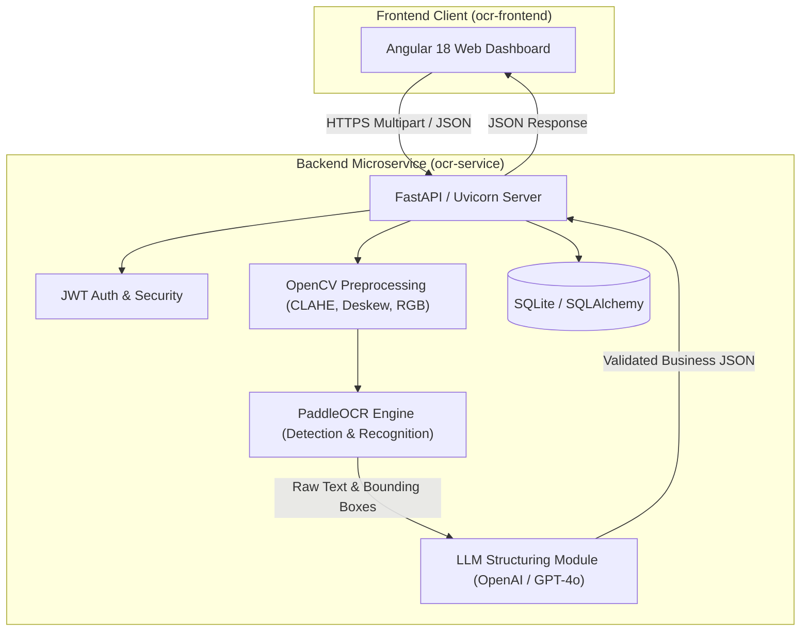

# 📄 Intelligent OCR & Document Understanding Microservice

[](https://fastapi.tiangolo.com)
[](https://angular.dev)
[](https://github.com/PaddlePaddle/PaddleOCR)
[](https://www.docker.com)
[](https://www.python.org)

An enterprise-ready **Intelligent Optical Character Recognition (OCR) and Document Structuring** platform. Combining high-performance computer vision (**PaddleOCR**, **OpenCV**) with Generative AI (**LLMs**), this system extracts text from images and multi-page PDFs and transforms unstructured documents into strongly typed, validated business JSON payloads.

---

## 📑 Table of Contents

- [Key Features](#-key-features)
- [System Architecture](#-system-architecture)
- [Tech Stack](#-tech-stack)
- [Project Directory Structure](#-project-directory-structure)
- [REST API Endpoints](#-rest-api-endpoints)
- [Getting Started](#-getting-started)
  - [Prerequisites](#prerequisites)
  - [Method 1: Docker Compose (Quickest)](#method-1-docker-compose-quickest)
  - [Method 2: Manual Local Development](#method-2-manual-local-development)
- [Environment Configuration](#-environment-configuration)
- [Testing](#-testing)
- [Contributing & Conventions](#-contributing--conventions)
- [License](#-license)

---

## 🚀 Key Features

- **⚡ High-Performance OCR Pipeline**:
  - Leverages **PaddleOCR** with optimized CPU threading (`cpu_threads=4`) and inference resizing (`text_det_limit_side_len=960`).
  - Supports image formats (PNG, JPG, TIFF) and **multi-page PDF** documents.
- **🌍 Advanced Multilingual & Arabic RTL Handling**:
  - Full bidirectional text reshaping with `arabic-reshaper` and `python-bidi`.
  - Automatic normalization of Eastern Arabic numerals (`٠-٩` $\rightarrow$ `0-9`).
- **🤖 Generative AI Document Structuring**:
  - Parses raw unstructured OCR text into domain-specific schemas (Invoices, Receipts, Generic Forms).
  - Extracts line items, vendor details, invoice numbers, tax amounts, subtotals, currencies (SAR, TND, EUR, USD, etc.).
- **🔐 Built-in Authentication & Document History**:
  - JWT (JSON Web Token) authentication with password hashing (`bcrypt`).
  - SQLite database managed by **SQLAlchemy** to store processing history and extracted metadata.
- **💻 Modern Angular 18 Web UI**:
  - Drag-and-drop document upload with real-time visual previews.
  - Interactive bounding box renderer on scanned documents.
  - Formatted and syntax-highlighted JSON viewer with copy and download utilities.
  - User authentication flows (Register / Login / Protected Routes).
- **🐳 Production-Ready Infrastructure**:
  - Multi-stage Docker builds with Nginx reverse proxy.
  - Automated CI/CD pipelines via GitLab CI/CD.

---

## 🏛 System Architecture



---

## 🛠 Tech Stack

| Layer | Technologies |
|---|---|
| **Frontend** | Angular 18+, TypeScript, Vanilla CSS (CSS Variables), RxJS, Nginx |
| **Backend API** | Python 3.10+, FastAPI, Uvicorn, Pydantic, SQLAlchemy |
| **Computer Vision** | PaddleOCR v3+, PaddlePaddle, OpenCV (`opencv-python-headless`), NumPy |
| **Language & Text** | `arabic-reshaper`, `python-bidi`, PDF2Image / PyMuPDF |
| **AI / LLM** | OpenAI API / GPT-4o structured extraction |
| **Security & DB** | JWT (`python-jose`), Passlib (`bcrypt`), SQLite |
| **DevOps & CI/CD** | Docker, Docker Compose, GitLab CI/CD |

---

## 📂 Project Directory Structure

```text
ocr-intelligent/
├── .gitlab-ci.yml             # GitLab CI/CD automated pipeline
├── docker-compose.yml         # Multi-container orchestration
├── AGENT.md                   # Agent & coding guidelines
├── documentation/             # Technical architecture & API specs
│   ├── api-specs.md
│   └── architecture.md
├── ocr-frontend/              # Angular 18 Single Page Application
│   ├── Dockerfile
│   ├── nginx.conf
│   ├── package.json
│   └── src/
│       ├── app/
│       │   ├── components/    # Dashboard, Upload, History, Viewer, Auth
│       │   ├── core/          # Interceptors, Guards
│       │   └── services/      # OCR and Auth services
│       └── environments/
└── ocr-service/               # FastAPI Python Microservice
    ├── Dockerfile
    ├── requirements.txt
    ├── tests/                 # Unit & integration tests
    └── src/
        ├── main.py            # API routing & controllers
        ├── ocr.py             # PaddleOCR & PDF extraction helpers
        ├── auth.py            # JWT token & user authentication
        ├── models.py          # SQLAlchemy database models
        └── database.py        # Database connection session
```

---

## 📡 REST API Endpoints

### Health & Core OCR

| Method | Endpoint | Description |
|---|---|---|
| `GET` | `/api/health` | Returns health status (`{"status": "UP"}`) |
| `POST` | `/api/ocr` | Extracts raw text and bounding boxes from an uploaded image or PDF |
| `POST` | `/api/ocr/analyze` | End-to-end OCR extraction + LLM structuring into business JSON |

### Authentication & History

| Method | Endpoint | Description |
|---|---|---|
| `POST` | `/api/auth/register` | Register a new user account |
| `POST` | `/api/auth/login` | Authenticate user and obtain a JWT bearer token |
| `GET` | `/api/history` | Retrieve processing history for the authenticated user |
| `DELETE` | `/api/history/{id}` | Delete a specific document processing history record |

---

## 🏁 Getting Started

### Prerequisites

- [Docker](https://docs.docker.com/get-docker/) & [Docker Compose](https://docs.docker.com/compose/)
- *Or for manual setup:*
  - Python 3.10+
  - Node.js 18+ and npm
  - C++ Build Tools & libGL (`libgl1-mesa-glx` on Linux)

---

### Method 1: Docker Compose (Quickest)

1. **Clone the repository:**
   ```bash
   git clone https://github.com/yusff08/ocr-intelligent.git
   cd ocr-intelligent
   ```

2. **Configure environment variables:**
   ```bash
   cp ocr-service/.env.example ocr-service/.env
   # Add your OPENAI_API_KEY in ocr-service/.env
   ```

3. **Build and launch the containers:**
   ```bash
   docker-compose up --build
   ```

4. **Access the applications:**
   - **Frontend UI:** [http://localhost:80](http://localhost:80)
   - **FastAPI Swagger Docs:** [http://localhost:8080/docs](http://localhost:8080/docs)
   - **Health Check:** [http://localhost:8080/api/health](http://localhost:8080/api/health)

---

### Method 2: Manual Local Development

#### 1. Backend (`ocr-service`)

```bash
cd ocr-service

# Create and activate virtual environment
python -m venv venv
# On Windows:
.\venv\Scripts\activate
# On Linux/macOS:
source venv/bin/activate

# Install dependencies
pip install -r requirements.txt

# Run FastAPI backend with Uvicorn
uvicorn src.main:app --host 0.0.0.0 --port 8080 --reload
```

#### 2. Frontend (`ocr-frontend`)

```bash
cd ocr-frontend

# Install dependencies
npm install

# Start development server
npm start
# or: ng serve --port 4200
```

Navigate to `http://localhost:4200/` in your browser.

---

## ⚙ Environment Configuration

Create a `.env` file in `ocr-service/`:

```ini
# OpenAI API configuration (Required for /api/ocr/analyze structuring)
OPENAI_API_KEY=your_openai_api_key_here

# JWT Authentication secret key
SECRET_KEY=your_super_secret_jwt_key_change_me
ALGORITHM=HS256
ACCESS_TOKEN_EXPIRE_MINUTES=1440

# PaddlePaddle execution flags
FLAGS_enable_pir_api=0
PADDLE_PDX_ENABLE_MKLDNN_BYDEFAULT=0
PADDLE_PDX_DISABLE_MODEL_SOURCE_CHECK=True
```

---

## 🧪 Testing

Run backend unit and integration test suites:

```bash
cd ocr-service
pytest -v
```

Run frontend unit tests:

```bash
cd ocr-frontend
npm test
```

---

## 📄 License

Distributed under the **MIT License**. See `LICENSE` for more information.

---

## 👤 Author

**Youssef Romdhane**
- GitHub: [@yusff08](https://github.com/yusff08)
- Email: [romdhane.youssef@esprit.tn](mailto:romdhane.youssef@esprit.tn)