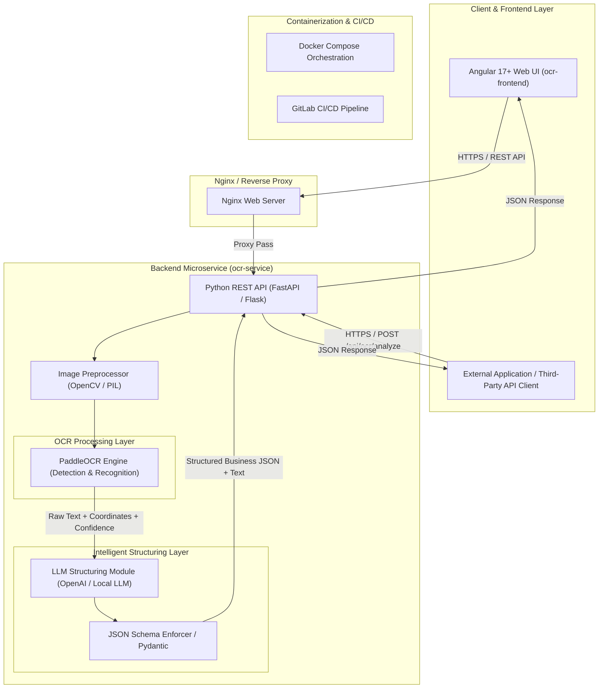
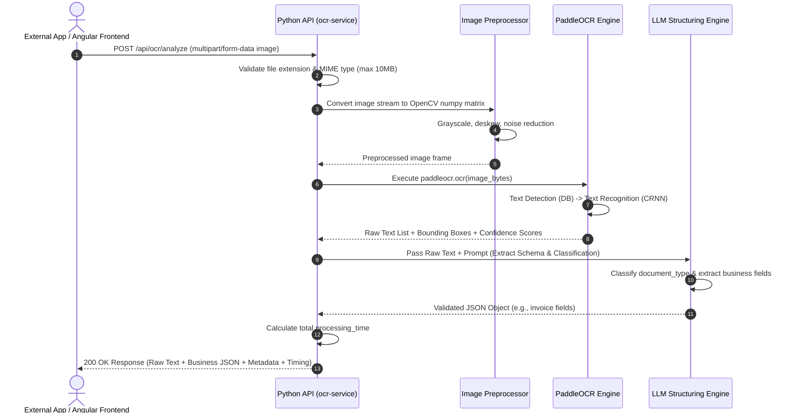
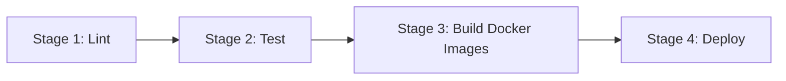

# Intelligent OCR Microservice Technical Architecture Document

## 1. Executive Summary

The **Intelligent OCR Microservice System** is an enterprise-grade solution designed to extract, analyze, and structure unstructured textual data from image documents (invoices, receipts, ID cards, forms, etc.). 

Combining modern front-end technologies (**Angular**), high-performance optical character recognition (**PaddleOCR**), and generative artificial intelligence (**LLM Data Structuring**), the system converts raw document pixels into structured, actionable **business JSON** payloads.

The entire solution is containerized using **Docker** and orchestrated via **Docker Compose**, with automated build, test, and deployment pipelines governed by **GitLab CI/CD**.

---

## 2. High-Level System Architecture



---

## 3. Key Components & Technologies

### 3.1 Frontend Interface (`ocr-frontend`)
- **Technology Stack:** Angular 17+, TypeScript, HTML5/CSS3 (Vanilla CSS with CSS Variables), RxJS.
- **Responsibilities:**
  - Provides a web-based interface for drag-and-drop file uploads (PNG, JPEG, TIFF, PDF).
  - Renders real-time visual previews of uploaded documents.
  - Displays OCR processing status, raw text extraction outputs, and syntax-highlighted business JSON.
  - Communicates asynchronously with the backend API via Angular `HttpClient`.

### 3.2 Backend REST API (`ocr-service`)
- **Technology Stack:** Python 3.10+, FastAPI (or Flask), Uvicorn ASGI server.
- **Responsibilities:**
  - Exposes RESTful endpoints (`/api/health`, `/api/ocr`, `/api/ocr/analyze`).
  - Handles file ingestion, payload validation, and multipart form-data decoding.
  - Manages thread pools and asynchronous execution for compute-intensive OCR tasks.
  - Formats standard success and error responses.

### 3.3 OCR Engine: PaddleOCR
- **Technology Stack:** PaddlePaddle framework, PaddleOCR Python SDK, OpenCV.
- **Responsibilities:**
  - **Text Detection:** Uses DB (Real-time Scene Text Detection) model to locate text regions and bounding boxes.
  - **Text Recognition:** Uses SVTR / CRNN models to extract text strings from detected bounding boxes.
  - Output features high-accuracy multi-language recognition (English, French, German, Spanish, etc.) and line-by-line confidence scoring.

### 3.4 AI Structuring Engine (LLM)
- **Technology Stack:** LLM integration layer (OpenAI GPT-4o / Ollama / Local Transformers), Pydantic / LangChain structured outputs.
- **Responsibilities:**
  - Receives unstructured raw OCR text and bounding box context.
  - Analyzes document layout to infer document category (`invoice`, `receipt`, `identity_card`, `bank_statement`).
  - Extracts key business entities into validated, strongly-typed **JSON schema** (e.g. invoice date, line items, total tax, vendor name).

---

## 4. End-to-End Processing & Data Flow Sequence



### Detailed Processing Steps

1. **Ingestion & Validation:** The client issues a `POST /api/ocr/analyze` request with an attached binary file. The microservice validates the file signature, size limit (10MB), and content type.
2. **Preprocessing:** The image matrix is decoded via OpenCV. Grayscale conversion, contrast normalization (CLAHE), and rotation correction are applied to optimize OCR accuracy.
3. **PaddleOCR Extraction:** PaddleOCR detects textual regions, extracts text strings line by line, and calculates confidence scores (e.g., `0.95`).
4. **LLM Schema Structuring:** The raw extracted text is passed to an AI LLM prompt equipped with JSON schema constraints. The LLM determines the document type and maps text snippets into structured keys (e.g., `vendor_name`, `total_amount`, `currency`).
5. **Response Synthesis:** The microservice aggregates the results and returns a JSON payload containing:
   - `success`: `true`
   - `document_type`: `"invoice"`
   - `metadata`: `{ "invoice_number": "...", "total": 1250.00 }`
   - `raw_text`: `"..."`
   - `processing_time`: `2.5`

---

## 5. Containerization & Infrastructure

### 5.1 Containerization with Docker

The microservice architecture is modularized into isolated Docker containers:

- **`ocr-frontend` Container:**
  - Multi-stage build: Stage 1 builds the production Angular bundle via Node.js; Stage 2 serves static assets using an optimized `Nginx` alpine container.
- **`ocr-service` Container:**
  - Built from a Python 3.10 slim base image with system dependencies (`libgl1-mesa-glx`, `libgomp1`) required by OpenCV and PaddlePaddle C++ runtimes.

### 5.2 Multi-Container Orchestration (`docker-compose.yml`)

`docker-compose.yml` manages local development and production deployment:

```yaml
version: '3.8'

services:
  ocr-service:
    build:
      context: ./ocr-service
      dockerfile: Dockerfile
    ports:
      - "8080:8080"
    environment:
      - PYTHONUNBUFFERED=1
      - LLM_API_KEY=${LLM_API_KEY}
    healthcheck:
      test: ["CMD", "curl", "-f", "http://localhost:8080/api/health"]
      interval: 10s
      timeout: 5s
      retries: 3

  ocr-frontend:
    build:
      context: ./ocr-frontend
      dockerfile: Dockerfile
    ports:
      - "80:80"
    depends_on:
      - ocr-service
```

---

## 6. Continuous Integration & Deployment (GitLab CI/CD)

The `.gitlab-ci.yml` pipeline automates code validation, automated testing, container image building, and deployment across `develop` and `main` branches.

### Pipeline Stages



1. **Lint & Code Style:** Runs `flake8` / `black` for Python and `eslint` for Angular.
2. **Test:** Runs unit and integration test suites (`pytest` for backend, `karma` / `jasmine` for frontend).
3. **Build:** Builds Docker container images and pushes them to the GitLab Container Registry.
4. **Deploy:** Automatically deploys updated containers to Staging (on `develop` branch updates) and Production (on `main` branch releases).
